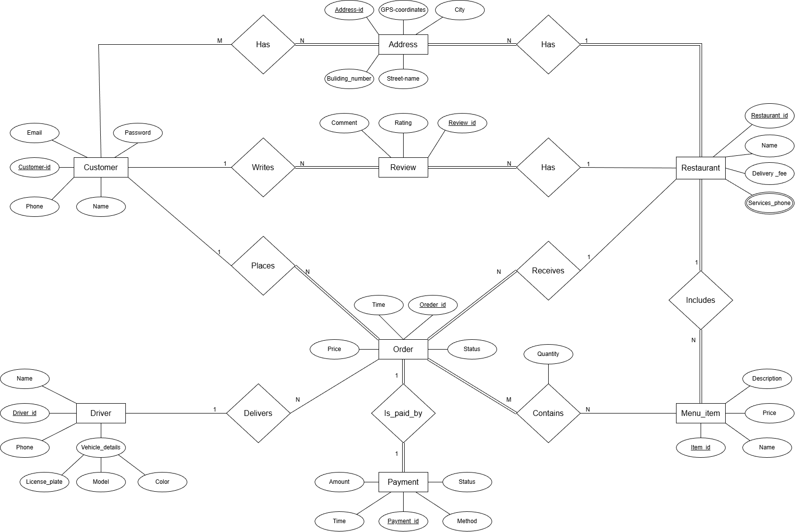

# Talabat Database Management System 🍔🍟

A comprehensive Database System for a food delivery application (Talabat Clone), built using **Oracle SQL** and **PL/SQL**. 

## 🏗️ Project Overview
This project focuses on the backend architecture of a delivery system, managing relationships between Customers, Restaurants, Drivers, and Orders. 

## 👤 My Role & Contributions
In this project, I was responsible for:
* **System Design (ERD):** Designing the Entity-Relationship Diagram and ensuring logical data flow and normalization.
* **Database Schema:** Implementing the schema with strict constraints (Primary/Foreign Keys, Checks).
* **Programmability (PL/SQL):** Developing Business Logic through Stored Procedures and Functions to automate system operations.

## 🛠️ Technical Features
- **Relational Design:** 10 interconnected tables covering all business aspects .
- **Data Integrity:** Implementation of constraints for ratings (1-5 stars) and payment methods.
- **Automation:** - `get_order_total`: Function to calculate total price including delivery fees.
  - `update_order_status`: Procedure to manage the order lifecycle and payment timestamps.
  - `add_restaurant_review`: Procedure to validate and insert user feedback.

## 📊 ERD Diagram

## 👥 Team Members
- **Team Leader:** Anthony George Shaker
- **Members:** 
    - Abanob Adly Gad
    - Kirolos Samy Tawadrous
    - Pierre Bassem Salah
    - Sabry Ehab Wahba
    - Marly Makram Lotfy
    - Jana Osama Abd-Alsalam 
    - Yasmeen Mohamed Desoky 
